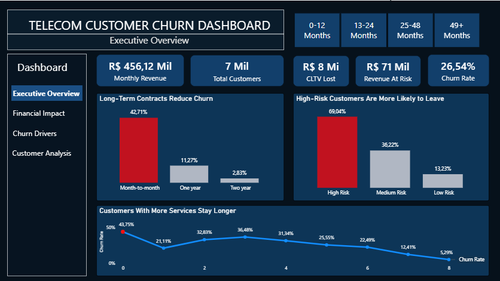
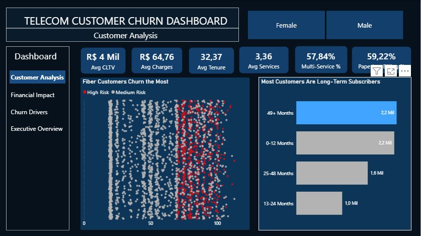
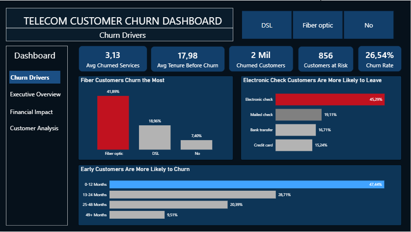
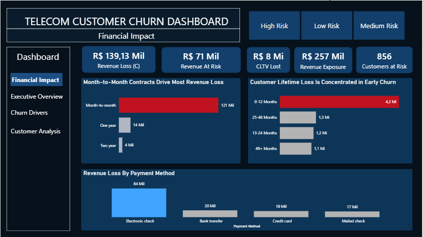

# 📊 Telecom Churn Analysis

End-to-end Data Analytics project focused on customer churn behavior, retention insights, and financial impact analysis using SQL and Power BI.

---

## 🚀 Project Overview

This project explores customer churn behavior in a telecom company, identifying patterns related to customer retention, revenue loss, and business risk.

The analysis was developed using:

* SQL for data exploration and KPI generation
* Power BI for dashboard development and storytelling
* Business metrics focused on churn and financial impact

---

## 🛠️ Tools & Technologies

* SQL
* Power BI
* DAX
* CSV Dataset
* Data Visualization
* Business Analytics

---

## 📁 Project Structure

```bash
├── data
├── sql
├── dashboard
├── images
└── README.md
```

---

## 📌 Dashboard Pages

### 1. Executive Overview

* Total Customers
* Churn Rate
* Revenue Metrics
* High-level business KPIs

### 2. Customer Analysis

* Customer demographics
* Contract distribution
* Internet service analysis
* Customer behavior patterns

### 3. Churn Analysis

* Churn by contract type
* Churn by payment method
* Risk segmentation
* Customer retention insights

### 4. Financial Analysis

* Revenue loss
* Revenue at risk
* Financial impact of churn
* Business opportunities

---

## 📷 Dashboard Preview

### Executive Overview



### Customer Analysis



### Churn Analysis



### Financial Analysis



---

## 📈 Key Insights

* Customers with month-to-month contracts showed significantly higher churn rates.
* Electronic check payment methods presented higher churn concentration.
* Long-term contracts demonstrated stronger customer retention.
* Churn has a direct impact on revenue stability and business growth.

---

## 📚 Dataset

Dataset used: Telecom Customer Churn Dataset.

---

## 👨‍💻 Author

Matheus Silva Lima

LinkedIn: (www.linkedin.com/in/matheus-silva-lima-466594292)
GitHub: (https://github.com/matheuslima-data)
